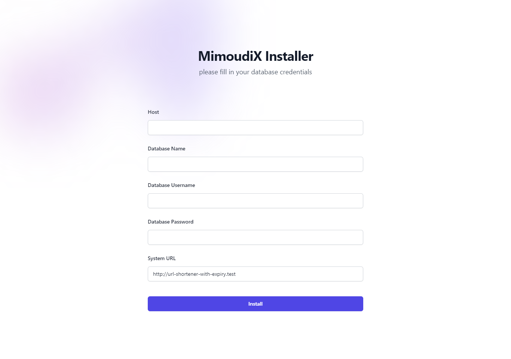

# PHP URL Shortener

This is a simple URL shortener web application built with PHP and MySQL.
[DEMO](https://shortify.mimoudix.com)

  

## Features

- Shortens URLs to a six-character alphanumeric code
- Allows users to specify an expiry time for the short URL
- Handles invalid or expired short URLs gracefully

## Requirements

- PHP 7 or later
- PDO extension for PHP
- MySQL 5.6 or later
- Apache 'mod_rewrite' module

## Installation

1. Clone this repository to your local machine
2. Upload all the files to your web server
3. Run the script and fill in your database credentials
4. Done !

  

